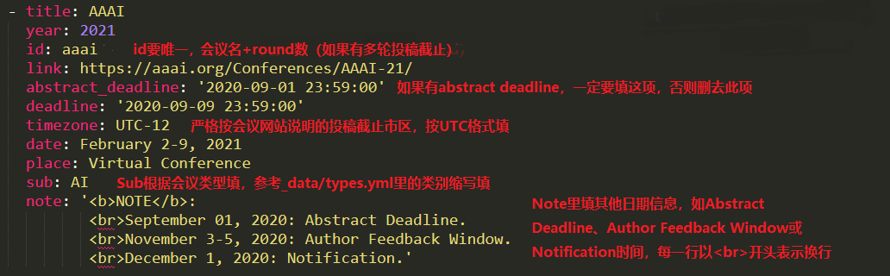

## Conference Deadlines

Countdown timers to keep track of a bunch of SE/PL conference deadlines.

## How to use
To add or update a deadline:
- Update `_data/conferences.yml`
- Make sure it has the `title`, `year`, `id`, `link`, `deadline`, `timezone`, `date`, `place`, `sub` attributes
    + See available timezone strings [here](https://momentjs.com/timezone/).
- Optionally add an `abstract_deadline` in case the conference has a separate mandatory abstract deadline
- Add a `note` to include other information, e.g., author feedback date and notification date. Use `<br>` in `note` to start a new line. 



To run it in local machine:

```
gem install jekyll bundler  # install environment
bundle install
bundle exec jekyll serve    # run in local machine
jekyll build                # generate html file
bundle exec jekyll remove   # remove html file
```

## License

- [Original Repo][2]
- [MIT][1]

[1]: https://abhshkdz.mit-license.org/
[2]: https://github.com/abhshkdz/ai-deadlines